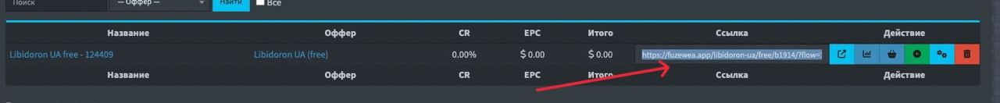
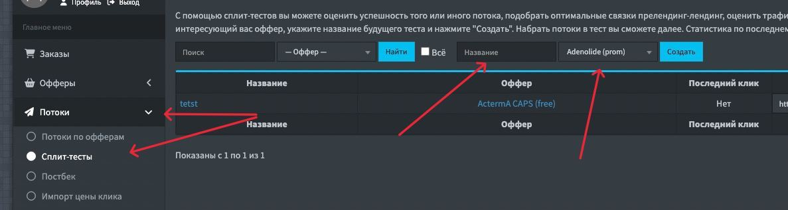
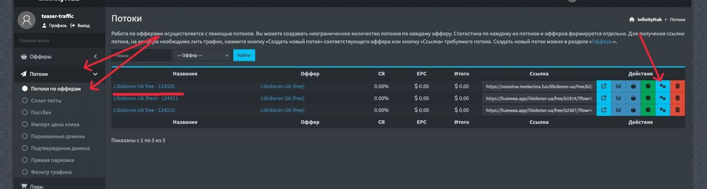
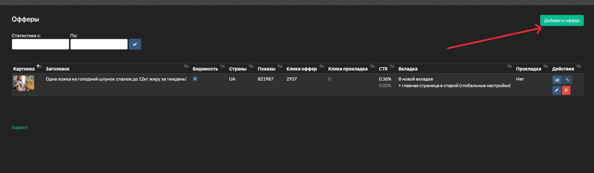

# Документация для тизерного трафика

Содержание:
1. [Создание потока](#создание-потока)
2. [Создание сплита](#создание-сплита)
3. [Смена блека на активном потоке](#смена-блека-на-активном-потоке)
4. [Статистика по меткам](#статистика-по-меткам)
5. [Общая статистика](#общая-статистика)
6. [Витрина](#витрина)
7. [Доступы](#доступы)


## Создание потока
Разберем создание потока на примере оффера `Libidoron UA (free)`

Заходим в личный кабинет. Нажимаем на `Офферы` слева в меню и выбираем интересующую нам категорию. В нашем случае - `потенция`.


После того, как нашли нужный нам оффер, нажимаем кнопку `Создать новый поток`.


В названии потока можно указать абсолютно любую информацию, которая будет для вас полезна в дальнейшем при поиске этого потока. Название отображается только в вашем кабинете в потоках.


Далее в поле `Лендинг` можно выбрать из перечня лендинг, который будем заливать. Справа есть голубая кнопка для просмотра страницы. Для отметки нужно просто нажать на лендинг с нужным названием.


> ❗️ Обязательно нужно указать свой домен в этом поле. В нашем случае это: `narodna-medeciina.fun` (он будет в списке).
> 

Далее можно указать необходимые нам метки, которые будут использоваться в ссылке. Это зависит уже от вашей сетки и других параметров.


Далее сохраняем настройки потока в самом низу. В конечном итоге все свои потоки можно посмотреть во вкладке: 
```
Потоки > Потоки по офферам
```

Конечная ссылка и есть ссылкой на которую заливаем:




## Создание сплита

Для того, чтобы создать сплит, нужно зайти в меню:
```
Потоки > Сплит-тесты
```

В открывшемся окне выбираем оффер, на который хотим создать сплит и вписываем название для сплита и нажимаем кнопку `Создать`.



Сначала нам нужно закрепить наш домен, нажимаем на кнопку `Привязать домен`, и ждем как кнопка станет зеленой.


Далее нажимаем кнопку `Добавить вариант в сплит` выше. Выбираем из наших ранее созданных потоков варианты, которые нам нужны в сплит.

Выбранные потоки можно дополнительно кастомизировать под сплит (настроить страны, итд)


Далее, ниже можно указать необходимые нам метки, которые будут использоваться в ссылке. Это зависит уже от вашей сетки и других параметров.

Нажимаем `Сохранить` и получаем готовую ссылку для залива.


## Смена блека на активном потоке

Чтобы изменить блек на активном потоке, заходим в наши потоки, выбираем интересующий нас поток, и в его настройках меняем в поле `Лендинг` на ленд, который нам нужен и внизу нажимаем кнопку `Сохранить`.




## Статистика по меткам

Чтобы посмотреть статистику по меткам, нужно зайти в меню:
```
Статистика > UTM-метки
```

В открывшемся окне можно посмотреть всю интересующую вас информацию отдельно по меткам. Отсортировать результат по дате, выбрать интересующий оффер/поток и др.

Также, порядок меток можно менять путём "перетаскивания" мыши по приоритету.

В статистике можно посмотреть:
- Название метки
- Клики вместе с уникальными
- Показатель CR
- Показатель EPC
- "Грязный" и "чистый" процент аппрува
- Кол-во зашедших лидов
- Кол-во заявок в холде/обработке
- Кол-во отмен/треша/аппрувов


## Общая статистика

Чтобы посмотреть статистику по меткам, нужно зайти в меню:
```
Статистика > *любая интересующая нас статистика*
```

В открывшемся окне можно посмотреть всю интересующую вас информацию. Отсортировать результат по дате, выбрать интересующий оффер/поток и др.

В статистике можно посмотреть:
- Клики вместе с уникальными
- Показатель CR
- Показатель EPC
- "Грязный" и "чистый" процент аппрува
- Кол-во зашедших лидов
- Кол-во заявок в холде/обработке
- Кол-во отмен/треша/аппрувов


## Витрина
Для того, чтобы настроить витрину, нам нужно зайти в админ-панель нашей витрины. 

Админ-панель витрины доступна по следующему адресу:
```
narodnii-pomichnik.org/admin
test1337
```

Нам доступны следующие параметры:
- Главная страница (с небольшой статистикой)
- Статистика
- Тизеры
- Настройки

Главная страница, как и было сказано ранее, представляет собой небольшую страницу-статистику общую.

Статистика - страница с табличной статистикой с возможностью выбрать дату/период.

Настройки - в настройках желательно ничего не изменять, кроме всплывающего окна и настройки гифтов. Под определенную категорию можем выбрать определенный гифт.

Тизеры - страница для просмотра созданных тизеров и их настройке или просмотре статистики. Тут же можно и создать новый тизер. Для этого нужно нажать кнопку `Добавить оффер`.




- Указываем необходимые настройки, изображения и названия.

- Заголовок оффера - это название, которое будет отображаться у людей, что видят рекламу.

Ссылка - дополнительно созданный поток в CPA отдельно под витрину по оффер, который нам нужен, копируем ссылку и к ней приписываем:
```
&utm_source=vitrina&utm_content=[OID]
```

> Пример: https://narodna-medeciina.fun/normal-size/free/buy/?flow=53282&utm_source=vitrina&utm_content=[OID]

Вкладка при открытии - то, как будет открываться ваше объявление у человека.

В старой вкладке - то, что будет происходить на старой вкладке у человека.


## Доступы
Ссылка на вход в CPA:   
https://infinity-lab.io/?recoverpass=e73f0099de862293fd315fdb6b61850ff87ef0192cc250329d751b1d519b58d6b0

WebID - 231

Домен - narodna-medeciina.fun

Витрина - narodnii-pomichnik.org

Доступы к витрине:    
narodnii-pomichnik.org/admin   
пароль - test1337
